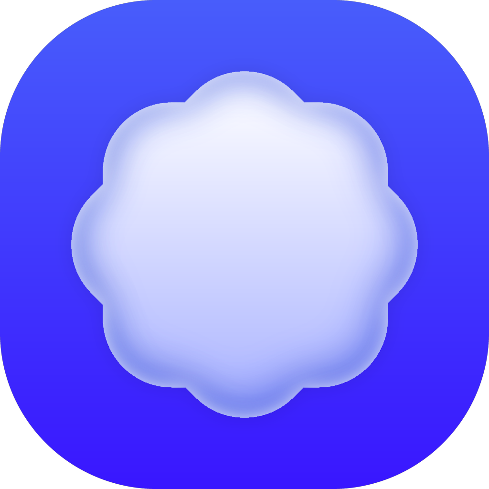

<!-- Header -->
<div align="center">
  <a href="https://buzzkit.dev/buzz">
    
  </a>

  <h3 align="center">Buzz</h3>
  <b>What your coding agents are doing, on your Lock Screen</b>
</div>

<!-- TOC -->
<p align="center">
    <a href="https://buzzkit.dev/buzz"><strong>Learn more »</strong></a>
    <br />
    <br />
    <a href="#introduction">Introduction</a>
    ·
    <a href="#the-endpoint">The Endpoint</a>
    ·
    <a href="#how-it-fits-together">How It Fits Together</a>
    ·
    <a href="#building">Building</a>
</p>

## Introduction

Buzz gives your phone one endpoint your coding agents post to. They send a notification when work finishes, keep a Live Activity on your Lock Screen while it runs, and flag when they are blocked and need you. Several agents running at once merge into one live view, sorted by whichever one needs you first.

Buzz reports; it never acts for you. When an agent is blocked it shows "Waiting on you" and you make the call where you always have, in your editor. There is no account and nothing to install on the machine running the agent: it reads one setup guide, claims a six-digit code, and starts posting. Anything else that can make an HTTP request, a CI job or a shell script, can use the same endpoint.

Buzz is a product built on [BuzzKit](https://buzzkit.dev), the open source notification framework, on the same public SDK anyone else would use. Get it at [buzzkit.dev/buzz](https://buzzkit.dev/buzz).

## The Endpoint

Everything is one `POST`. A finished piece of work is a notification:

```sh
curl -X POST https://ping.buzzkit.dev/YOUR_KEY \
  -d '{"title":"Tests passed","body":"142 passed in 38s","agent":"claude-code"}'
```

Add a stable `session` and the same call drives a Live Activity instead, updating in place as the work moves:

```sh
curl -X POST https://ping.buzzkit.dev/YOUR_KEY \
  -d '{"session":"api/migrate","title":"Running migrations","progress":0.4,"status":"working"}'
```

Set `status` to `waiting` when the agent is blocked, and it floats to the top of the Lock Screen as "Waiting on you". The `agent` field puts that agent's avatar on the notification. The full agent guide lives at [`ping.buzzkit.dev/skill.md`](https://ping.buzzkit.dev/skill.md).

## How It Fits Together

| Piece | Where |
| --- | --- |
| The app | this repository |
| The API | `apps/ping` in the [buzzkit](https://github.com/buzzkit-dev/buzzkit) monorepo, at `ping.buzzkit.dev` |
| The product page | [buzzkit.dev/buzz](https://buzzkit.dev/buzz) |
| The agent setup guide | [`ping.buzzkit.dev/skill.md`](https://ping.buzzkit.dev/skill.md) |

The app pairs with the API once and stores its credentials in the Keychain. From then on the API derives one merged Live Activity from every agent's session and pushes it; the app reports back the activity id and its push tokens, and mirrors the running activity into its own timeline.

## Building

Requires Xcode 27.

```sh
open Buzz.xcodeproj
```

The [BuzzKit iOS SDK](https://github.com/buzzkit-dev/buzzkit-ios) is a remote Swift package; to work on both at once, drag a local checkout of it into the project and Xcode uses that copy instead. Targets, entitlements and build settings live in the project itself.

Releases ship through Xcode Cloud: push a `vX.Y.Z` tag and `ci_scripts/ci_post_clone.sh` writes that version into the project before the archive.

```
Buzz/                     The app: pairing, the timeline, the connect screen
Shared/                   Compiled into both the app and the widget
├── Activity/             The Live Activity wire contract and its sample states
├── Networking/           The ping client, app-group storage, agent avatars
└── UI/                   Theme tokens, the Lock Screen views, shared components
BuzzWidget/               The Live Activity and Dynamic Island
BuzzNotificationService/  Turns each push into a communication notification (the agent's avatar)
```

## License

The Buzz app is licensed under the [MIT License](LICENSE). The BuzzKit framework it is built on is [AGPLv3](https://github.com/buzzkit-dev/buzzkit/blob/main/LICENSE).
